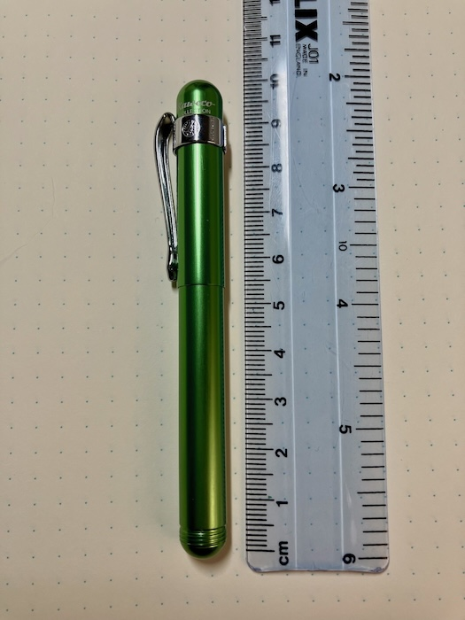
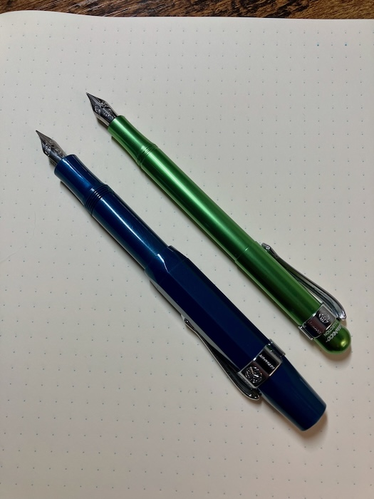

With the pending release of a new Kaweco Collection ("Collection" = limited edition) aluminum Liliput in a [lovely sky blue](https://www.kaweco-pen.com/en/pens/fountain-pens/950/kaweco-collection-fountain-pen-liliput-blue), it's a good time to post a review. I have a slightly older Liliput in the Collection series in bright green.

The pocket clip is sold separately; you'll need one if you need to, well, clip it somewhere, but also if you're concerned about it rolling away. Fortunately they're only about $6 US, and come in chrome (shown) or bronze. Some reviewers say they scratch the finish, but I haven't noticed a problem so far.

## The Body

As the name suggests, this pen is _little_. It's literally just wide enough to accommodate the standard Kaweco nib assembly and European cartridge. In fact I find it a bit too slender to write with comfortably for an extended period, and I have small hands. But, it would be perfect for the pen loop of a compact planner.

For comparison, here it is next to a plastic Kaweco Sport. The Sport is far more comfortable to hold (the grip part is much wider), but thanks to its iconic chunky hexagonal cap, tends not to fit in pen loops. 

The quality of the machining on the Liliput is top-notch. There's something very satisfying about it because of that, more than with plastic. I've been able to try an aluminum Sport before too, and it was also extremely nice--it might be a better choice if you're interested in having the aluminum, depending on where you want to use it.

## The Nib

Kaweco nibs are, on one hand, conveniently interchangeable, but on the other, notorious for their spotty build quality. Of the four I've had, two of them came very dry and scratchy out of the box, and needed some work before they were decent to write with. It's not a big deal (see [JetPens' excellent guide](https://www.jetpens.com/blog/How-to-Troubleshoot-a-Fountain-Pen/pt/777)), but would not be a great experience for someone brand new to fountain pens. That said, I like them quite a lot when they're working properly. The nib is smaller and shorter than is typical of other manufacturers, so your hand is a bit closer to the paper, and it feels different. They're also very easy to disassemble (and reassemble!) for cleaning. 

## The Price

Aluminum Liliputs run about $60 USD for a standard color, $80 for a limited "Collection" color. I got mine for a lot less in a Fountain Pen Day sale, since apparently the green ones were not great sellers. (Fountain Pen Day occurs on the first Friday of November each year, and is primarily celebrated by shops shifting their deadstock. Which is fine?) The "Collection" list prices are always a little high, leaving it for the pen enthusiast to decide if it's worth it to them to have that particular color. I feel like the baseline price is reasonable, though, provided you know what you're getting into with how very tiny it is, and Kaweco nibs in general. And, you can sometimes find them for less anyway.

Liliputs also come in copper, brass, or steel, which are correspondingly more expensive than aluminum, but very cool. Sports come in other metals also, but I suspect they would get too heavy whereas the Liliputs do not. So... here's the thing. This is a cool pen. It's an appealing design, and fun to have and use, within reason. Just maybe don't try to take notes through a long lecture with it.